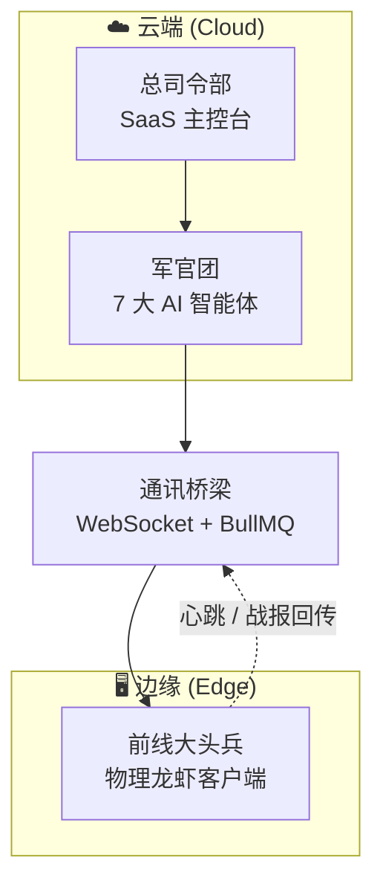
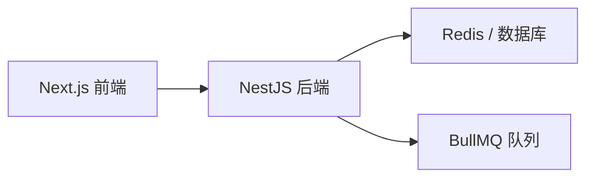
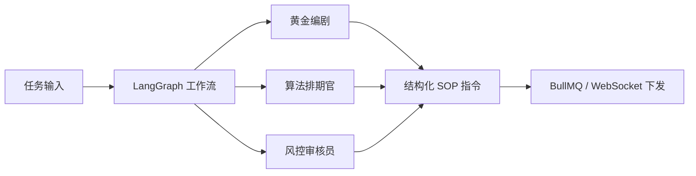
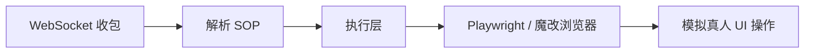
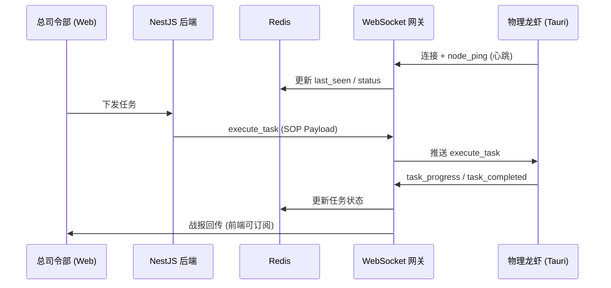

# ClawCommerce 核心系统架构蓝图 (Architecture Blueprint)

> **云边协同 (Cloud-Edge)** 主从架构 — 司令部 → 军官团 → 前线大兵  
> 本文档为后续所有代码生成的**最高指导原则**。

---

## 一、三层指挥体系概览

---

## 二、第一层：总司令部（云端 SaaS 主控台）

| 维度 | 说明 |
|------|------|
| **定位** | 发号施令、看战报、收保护费 |
| **物理形态** | 部署在咱们服务器上的 Web 页面（Next.js）和后端大脑（NestJS + Redis/DB） |
| **功能** | 客户在这里充钱、配置 API 密钥、查看线索大盘、统筹全局、下发任务 |

**边界铁律**：总司令部**不**直接执行任何无头浏览器（Puppeteer/Playwright）自动化操作；只做调度、存储与展示。

---

## 三、第二层：军官团（云端 7 大 AI 智能体）

| 维度 | 说明 |
|------|------|
| **定位** | 专业级「脑力资产」— 只思考，不干体力活 |
| **物理形态** | 跑在云端的 AI 代码逻辑（LangGraph + 提示词 + LLM 调用） |
| **功能** | 【黄金编剧】扩写剧本；【算法排期官】计算发布时间；【风控审核员】检查违禁词；等。输出为**傻瓜操作包**（结构化 SOP 指令） |

**边界铁律**：军官团**仅**在云端运行；**绝不在**客户端（Tauri/Rust）中包含任何大模型调用或业务决策逻辑。

---

## 四、第三层：前线大头兵（边缘物理龙虾）

| 维度 | 说明 |
|------|------|
| **定位** | 咱们的「手脚」— 无脑执行 |
| **物理形态** | 客户本机 Windows 上的轻量级客户端（Tauri + Rust + Playwright） |
| **功能** | 接收云端下发的**傻瓜操作包**，按 SOP 执行：如 14:00 打开小红书、输入文案、点击发送、关闭浏览器 |

**为何必须用客户的龙虾？**  
借助客户真实的家用宽带 IP、真实电脑硬件环境对抗平台风控；云端服务器无法替代。

**边界铁律**：客户端**不**做业务决策、**不**调大模型；只接收结构化指令并 100% 模拟真人 UI 自动化执行。

---

## 五、通讯桥梁（WebSocket + BullMQ）

| 通道 | 用途 |
|------|------|
| **WebSocket** | 云端 ↔ 龙虾 长连接：心跳、任务下发、进度与完成回传 |
| **BullMQ** | 云端内部：任务队列、Autopilot 流水线、Webhook 推送等异步链路 |

---

## 六、架构边界总结（必守）

| 禁止项 | 说明 |
|--------|------|
| ❌ 在客户端 (Tauri/Rust) 中调用大模型或做业务决策 | 脑子只在云端 |
| ❌ 在云端 (NestJS) 直接执行无头浏览器 (Puppeteer/Playwright) 自动化 | 手脚只在边缘 |

| 规范 | 说明 |
|------|------|
| ✅ 云端下发**结构化 SOP 指令**（如 LobsterTaskPayload） | 军官团输出傻瓜操作包 |
| ✅ 客户端仅解析并执行 SOP，并回传 task_progress / task_completed | 前线只干体力活 |

---

## 七、相关文档与代码锚点

- **SOP 指令集**：`backend/src/gateway/lobster-sop.types.ts` — `LobsterTaskPayload` 及 `actionType` 枚举
- **舰队通讯网关**：`backend/src/gateway/fleet-websocket.gateway.ts` — 心跳、任务下发、战报回传
- **龙虾连接（按激活码）**：`backend/src/gateway/lobster.gateway.ts` — 现有 Tauri 连接与顶号逻辑
- **前端任务总控**：`web/src/app/operations/orchestrator` — 依赖网关回传数据点亮进度
