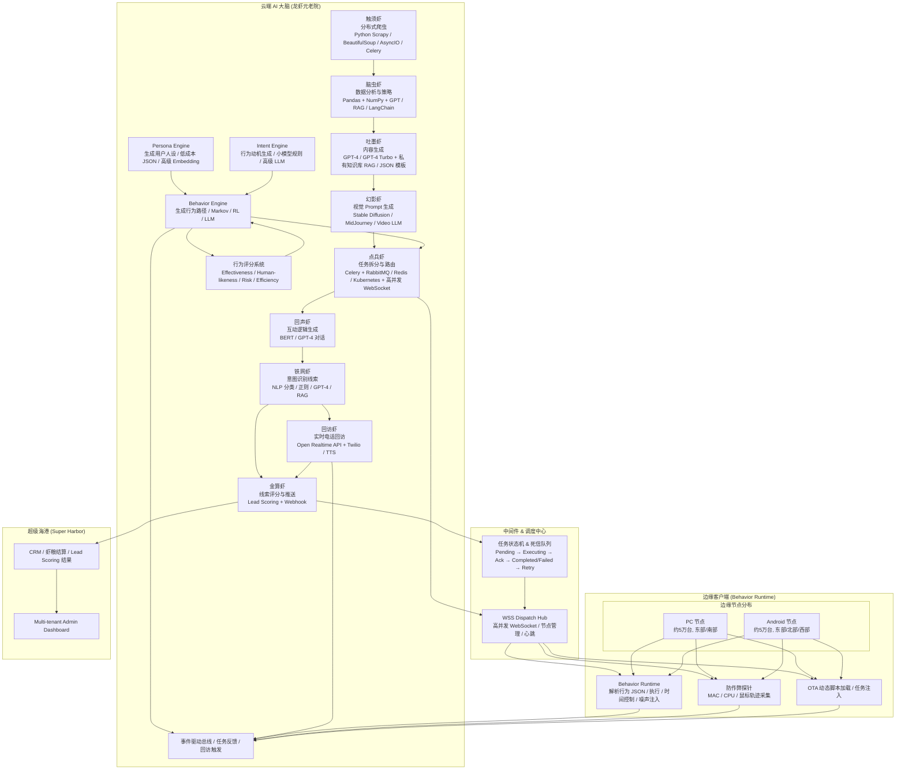

# 龙虾元老院 — 组织架构图与实现对应

本文档将「云端 AI 大脑（龙虾元老院）+ 中间件 + 边缘端 + 超级海港」组织架构图与当前仓库实现一一对应，便于按图完善项目。

---

## 1. 组织架构图（Mermaid）

**与原型设计示意一致**：云端工作流（Radar→…→Dispatcher）、Persona/Intent/Behavior/Scoring 引擎、BehaviorEngine→EventBus、中间件（WSS/TaskState/EventBus）、边缘 Runtime/Telemetry/OTA→EventBus、Abacus→CRM。其中 **BehaviorEngine → EventBus** 已在代码中实现：生成路径或会话时发出 `behavior_path_generated` 事件（`BehaviorEventBus.emitBehaviorPathGenerated`），见 `backend/src/behavior/behavior-event.bus.ts` 与 `behavior.controller.ts`。

---

## 2. 架构节点 → 本仓库实现对应表

### 2.1 云端 AI 大脑（龙虾元老院）

| 架构节点 | 技术栈（图中） | 本仓库实现位置 | 状态 |
|----------|----------------|----------------|------|
| **触须虾 Radar** | Scrapy / BeautifulSoup / AsyncIO / Celery | `backend/src/autopilot/workers/radar-sniffing.worker.ts`、`radar_sniffing_queue`；`textsrc/radar-brain/`（爬虫任务骨架） | ✅ 已有队列与 Worker，爬虫可扩展为 Python/Celery 或继续 Node |
| **脑虫虾 Strategist** | Pandas + NumPy + GPT/RAG/LangChain | 暂无独立模块；分析逻辑可放在 Radar 出队后或 `content_forge` 前 | 🟡 需补：独立策略分析服务或 content_forge 前置步骤 |
| **吐墨虾 InkWriter** | GPT-4 + RAG + 模板 JSON | `backend/src/autopilot/workers/content-forge.worker.ts`、`content_forge_queue`；`backend/src/agents/golden-writer/` | ✅ 已有队列与黄金编剧 Agent |
| **幻影虾 Visualizer** | Stable Diffusion / MidJourney / Video LLM | `backend/src/agents/visual-director/`；`marionette-protocol` 中 `visual_director` | ✅ 已有视觉导演 Agent，可接外部图/视频 API |
| **点兵虾 Dispatcher** | Celery + RabbitMQ/Redis + WebSocket | `backend/src/autopilot/workers/matrix-dispatch.worker.ts`、`matrix_dispatch_queue`；`backend/src/gateway/agent-cc.gateway.ts`、`lobster.gateway.ts` 任务下发 | ✅ 已有队列与网关派发 |
| **回声虾 Echoer** | BERT / GPT-4 评论互动 | `backend/src/agents/community-ninja/`；`CommentReplyServiceStub`（`integrations`） | 🟡 有骨架，评论回复逻辑待实装 |
| **铁网虾 Catcher** | NLP / 正则 / GPT-4 / RAG 意图识别 | `backend/src/agents/conversion-hacker/`；线索入 lead 前过滤/意图识别 | 🟡 转化黑客与线索流水线可扩展为 Catcher 层 |
| **金算虾 Abacus** | Lead Scoring + Webhook | `backend/src/autopilot/workers/lead-harvest.worker.ts`、`lead_harvest_queue`；`backend/src/integrations/webhook-dispatcher.service.ts` | ✅ 已有线索收割与 Webhook 推送 |
| **回访虾 FollowUp** | Open Realtime API + Twilio / 语音 | 暂无 | 🔴 待补：即时电话回访模块（可新建 `backend/src/follow-up/` 或挂接 Twilio） |
| **Persona Engine** | 用户人设 / JSON / Embedding | `backend/src/behavior/persona-engine.service.ts`、`GET /behavior/persona` | ✅ 已有 |
| **Intent Engine** | 行为动机 / 规则 / LLM | `backend/src/behavior/intent-engine.service.ts`、`POST /behavior/intent` | ✅ 已有 |
| **Behavior Engine** | 行为路径 / Markov / RL / LLM | `backend/src/behavior/behavior-engine.service.ts`、`POST /behavior/path`、经验池采样 | ✅ 已有 |
| **行为评分系统 ScoringEngine** | Effectiveness / Human / Risk / Efficiency | `backend/src/behavior/scoring-engine.service.ts`、`behavior-pool.service.ts`、`POST /behavior/log` | ✅ 已有 |

### 2.2 中间件 & 调度中心

| 架构节点 | 本仓库实现位置 | 状态 |
|----------|----------------|------|
| **WSS Dispatch Hub** | `backend/src/gateway/agent-cc.gateway.ts`（路径 `/agent-cc`）、`fleet-websocket.gateway.ts`；心跳与节点状态见 C&C 协议与调度策略 | ✅ 已有 |
| **任务状态机 & 死信队列** | `backend/src/autopilot/autopilot-dlq.service.ts`、`autopilot-task-control.service.ts`、`*_dlq` 队列；状态流 Pending→Executing→Ack→Completed/Failed | ✅ 已有 |
| **事件驱动总线 EventBus** | 任务反馈 / 行为完成 / 回访触发 | `backend/src/behavior/behavior-event.bus.ts`（`high_intent_lead`、`behavior_completed`）；边缘上报经 POST /behavior/log 后触发 `behavior_completed` | ✅ 已有 |

### 2.3 边缘客户端（Behavior Runtime）

| 架构节点 | 本仓库实现位置 | 状态 |
|----------|----------------|------|
| **Behavior Runtime** | `src/agent/behavior-runtime.ts`（`interpret`/`runPath` 解析行为 JSON、时间控制）；边缘收到 `execute_behavior_session` 后执行；上报 `POST /behavior/log` | ✅ 已有 |
| **RPA / 任务执行** | `src/agent/`（Node + Playwright）、`docker/lobster/`（OpenClaw + 技能）；执行 `execute_task`（LobsterTaskPayload） | ✅ 已有 |
| **WebSocket 心跳与连接** | 客户端连 `backend` 的 `/fleet` 或 `/agent-cc`；协议见 `docs/C&C_WebSocket_协议规范_v1.21.md` | ✅ 已有 |
| **防作弊探针 Telemetry** | 协议与需求见 `docs/燎原引擎_五大核心工程模块_架构设计.md` §4；客户端上报 MAC/CPU/行为轨迹，后端规则引擎 | 🟡 设计已有，端侧探针与云端规则待完善 |
| **OTA 动态脚本加载** | 同上 §1；任务包携带 `script_version`/`script_url`，边端空壳拉取执行 | 🟡 设计已有，下发与边端拉取待实装 |

### 2.4 超级海港（SaaS）

| 架构节点 | 本仓库实现位置 | 状态 |
|----------|----------------|------|
| **CRM / 虾粮结算 / Lead Scoring 结果** | `web/` 线索页、计费/配额（见 PRD）；`superharbor/` 若启用则含 CRM/线索库 | ✅ 已有前端与后端线索/Webhook |
| **Multi-tenant Admin Dashboard** | `web/`（Next.js）多租户、边缘算力池、战术发射台、全息数字员工大盘、RAG 私有知识库等 | ✅ 已有 |

---

## 3. 数据流与队列对应

- **Radar → Strategist → InkWriter → Visualizer → Dispatcher**  
  对应队列顺序：`radar_sniffing_queue` → （策略层可插在中间）→ `content_forge_queue` → `matrix_dispatch_queue`。  
  见 `backend/src/autopilot/autopilot.constants.ts` 注释与各 Worker 的入队/出队。

- **Dispatcher → 边缘**  
  点兵虾通过 WSS 下发：`execute_task`（LobsterTaskPayload，如 UPLOAD_VIDEO）或 `execute_behavior_session`（BehaviorSessionDispatchPayload）。边缘 Behavior Runtime 收到后者后解析 `behavior_path` 执行；完成后可上报 `POST /behavior/log`。

- **边缘 Runtime / Telemetry / OTA → EventBus**  
  边缘上报行为完成：HTTP `POST /behavior/log` → BehaviorLogger 打分入池 → BehaviorEventBus.emitBehaviorCompleted；高意向线索由 Catcher 触发 `high_intent_lead` → FollowUp 监听。

- **Dispatcher ↔ Behavior Engine**  
  Behavior Engine 产出 `BehaviorSessionPayload`；如需经 WSS 下发，可调用 `FleetWebSocketGateway.dispatchBehaviorSession(nodeId, payload)`；MatrixDispatchWorker 当前仅下发 LobsterTaskPayload，行为会话下发可由调度层按需调用 Gateway。

- **Abacus → TaskState / CRM**  
  `lead_harvest_queue` 消费后写库、推 Webhook、更新任务状态；CRM/Admin 从后端 API 读线索与结算数据。

---

## 4. 按图修正项（已做与待办）

| 修正项 | 说明 | 状态 |
|--------|------|------|
| **EventBus 统一** | 中间件「事件驱动总线」对应 `BehaviorEventBus`，支持 `high_intent_lead`、`behavior_completed`；边缘 POST /behavior/log 后触发 `behavior_completed` | ✅ 已做 |
| **Dispatcher 支持行为会话下发** | `FleetWebSocketGateway.dispatchBehaviorSession(nodeId, payload)`，边缘收 `execute_behavior_session` 后由 Behavior Runtime 执行 | ✅ 已做 |
| **边缘 Runtime → EventBus** | 边缘通过 HTTP 上报 /behavior/log，服务端打分入池并 emit `behavior_completed`，与图中「Runtime → EventBus」一致 | ✅ 已做 |
| **调度层消费 Behavior 产出** | MatrixDispatchWorker 或其它调度逻辑在需要时调用 `dispatchBehaviorSession`，将 Behavior Engine 产出的会话下发给指定节点 | 🟡 按需接入 |
| **Telemetry / OTA 实装** | 探针上报与 OTA 拉取在边缘与云端完整落地 | 🟡 见燎原引擎文档 |
| **回访虾 FollowUp** | 监听 `high_intent_lead`，对接 Twilio / Realtime API | 🔴 待补 |

---

## 5. 完善建议（按图补全）

1. **脑虫虾 Strategist**  
   - 在 `radar_sniffing` 与 `content_forge` 之间增加「策略分析」步骤：或新队列 `strategist_queue`，或 content_forge Worker 内调用策略服务（Pandas/NumPy/LLM 分析竞品数据后输出文案/视觉参数）。

2. **回访虾 FollowUp**  
   - 新建模块 `backend/src/follow-up/`（或 `integrations/follow-up.service.ts`），对接 Twilio / Open Realtime API；由 Catcher 或 Abacus 触发「高意向线索即时回访」；结果回写线索状态并可与 Abacus 联动。

3. **回声虾 Echoer**  
   - 将 `CommentReplyServiceStub` 替换为真实实现：调用 BERT/GPT-4 或现有 `community-ninja` 生成评论回复，由 Dispatcher 或边缘执行器执行回复动作。

4. **铁网虾 Catcher**  
   - 在线索入 lead 表前统一经「意图识别」管道：可放在 `lead_harvest` 前一步或独立 `catcher_queue`；使用现有 conversion-hacker / NLP/正则/GPT-4/RAG 做高意向拦截。

5. **OTA 与 Telemetry**  
   - 按 `docs/燎原引擎_五大核心工程模块_架构设计.md` 与 `docs/liaoyuan-os-full-process-playbook.md` 执行：任务包扩展 `script_version`/`script_url`；边端探针上报与云端规则引擎、风控策略落地。

---

## 6. 相关文档

- 协议与调度：`docs/C&C_WebSocket_协议规范_v1.21.md`、`docs/ClawCommerce_PM_v1.23_智能调度策略.md`
- 全流程与术语映射：`docs/liaoyuan-os-full-process-playbook.md`
- 五大工程模块（OTA/隧道/状态机/探针/OLAP）：`docs/燎原引擎_五大核心工程模块_架构设计.md`
- **行为操作系统**（Persona/Intent/Behavior 引擎、行为调度）：`docs/行为操作系统_设计蓝图_合规边界内.md`，代码占位 `backend/src/behavior/`
- 提线木偶协议（云端→边缘 SOP）：`backend/src/gateway/marionette-protocol.ts`
