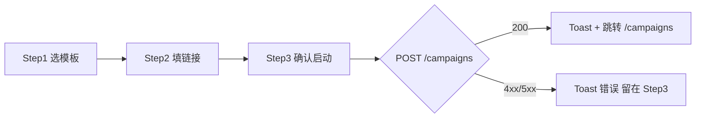

# 配置向导页 — 高保真文字原型

**页面路径**：`/onboard` 或 `/campaigns/new`（向导式）  
**目标**：≤3 步完成「选择模板 → 填对标链接 → 确认并启动」，傻瓜式、高转化。

---

## 全局

- **布局**：居中单列，最大宽度 640px；移动端全宽，步骤条可横向滚动。
- **进度**：顶部步骤条（Step 1 → 2 → 3），当前步高亮主色，已完成打勾，未完成灰。
- **按钮**：主操作「下一步 / 立即启动」主色、右对齐；「上一步」ghost、左对齐。

---

## Step 1：选择行业与模板（约 15s）

**状态 1a — 默认**

- 标题：选择行业与内容策略
- 副标题：一键套用成熟模板，无需写 Prompt
- **行业模板卡片**（3 选 1，单选）：
  - 10秒爆款短视频（3–6 分镜）— 适合快节奏种草
  - **15秒故事带货（7个分镜）** — 默认选中，主推
  - 30秒深度种草（10–18 分镜）— 适合高客单
- 交互：点击卡片即选中（边框主色 + 浅底），再次点击不取消（需点其他卡片切换）
- 底部：仅「下一步」按钮

**状态 1b — 加载中**

- 若从服务端拉取模板列表（未来）：步骤内 Skeleton 占位，无整页 loading

**字段来源**：`TEMPLATE_DYNAMIC_RULES` 或 `GET /api/v1/templates`（若后端提供）；当前可写死 3 项与 `design-system` 一致。

---

## Step 2：对标链接批量上传（约 30s）

**状态 2a — 默认**

- 标题：添加对标账号/视频链接
- 副标题：最多 20 条，每行一个或粘贴整段
- **输入区**：
  - 多行文本框（textarea），placeholder：`https://v.douyin.com/xxx` 换行粘贴
  - 实时计数：已输入 X / 20 条（超 20 条时截断并提示「已保留前 20 条」）
- **一键套用模板**（可选）：按钮「套用示例链接」，填入 3 条示例 URL（仅演示，可配置）
- **实时预览**（可选）：下方折叠区「预览解析结果」，展示前 3 条 URL 的域名+路径简写（不请求后端，仅前端格式化展示）
- 底部：「上一步」「下一步」

**状态 2b — 校验**

- 若未填或 0 条有效 URL：下一步 disabled，输入框下方红色提示「请至少添加 1 条有效链接」

**字段来源**：用户输入；校验规则与后端 `target_urls` 一致（1–20 条，合法 URL）。

---

## Step 3：确认并启动（约 10s）

**状态 3a — 默认**

- 标题：确认配置并启动
- **摘要卡片**：
  - 行业模板：Step 1 所选名称
  - 对标链接数：Step 2 条数
  - 策略说明：一行文案（如「15秒故事带货，7 个分镜，自动二创发布」）
- **可选高级**：折叠「高级设置」（日发布上限、活跃时段），默认折叠
- 底部：「上一步」「🚀 立即启动全自动运营」主按钮

**状态 3b — 提交中**

- 主按钮 loading（spinner + 禁用），不可重复点击
- 不整页白屏，仅按钮态变化

**状态 3c — 成功**

- 绿色 Toast：「任务已分配至 OpenClaw 节点池」
- 自动跳转至 `/campaigns` 任务列表

**状态 3d — 失败**

- 红色 Toast：后端返回 message 或「创建失败，请重试」
- 不跳转，用户可修改后再次点击启动

**接口**：`POST /api/v1/campaigns`，Body 来自 Step 1+2（industry_template_id, target_urls, content_strategy, bind_accounts），见 `web/src/services/endpoints/campaign.ts`。

---

## 响应式

- **桌面**：步骤条横向 3 段；表单宽度 640px 居中。
- **移动**：步骤条可横向滑动；输入框全宽；主按钮全宽、安全区 padding。

---

## 空状态 / 错误态

- Step 2 无有效链接：见 2b。
- 网络错误 / 401：由全局 axios 拦截器统一 Toast + 跳转登录，本页不单独处理。

---

## 交互流程图（Mermaid）

