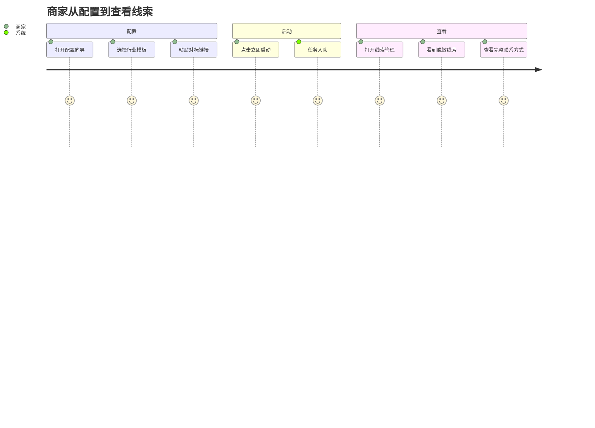

# 用户旅程图与可用性目标

## 核心路径：≤3 步

## 步骤与页面映射

| 步骤 | 动作 | 页面/组件 | 接口 |
|------|------|-----------|------|
| 1 | 选择行业/模板 | 配置向导 Step 1 | 本地 / GET /api/v1/templates |
| 2 | 填写对标链接（≤20） | 配置向导 Step 2 | 本地校验 |
| 3 | 确认并启动 | 配置向导 Step 3 | POST /api/v1/campaigns |
| — | 查看任务列表 | /campaigns | GET /api/v1/campaigns |
| — | 查看线索 | /leads | GET /api/v1/leads |
| — | 解密单条 | 弹窗 | GET /api/v1/leads/:id/reveal |

## A/B 测试计划（示例）

| 实验 | 对照 A | 变体 B | 指标 |
|------|--------|--------|------|
| 主按钮文案 | 「立即启动」 | 「🚀 立即启动全自动运营」 | 点击率、创建完成率 |
| 步骤条 | 仅数字 1/2/3 | 数字 + 简短标签 | 退出率、完成时间 |
| 模板卡片 | 列表 | 卡片网格 + 默认选中「15秒故事带货」 | 模板选择率、Step2 进入率 |

## 转化率目标

- 配置向导完成率 ≥ 85%（进入 Step1 到 POST 成功）
- 整体「访问 → 首次创建任务」转化率 ≥ 15%（PM 审核）
