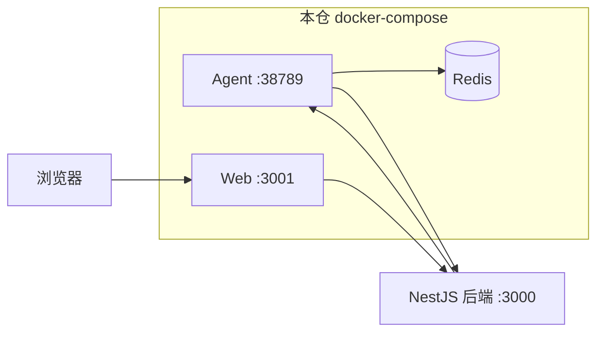

# ClawCommerce 部署说明（textinfra）

## 架构图



## 本地一键启动（仅本仓：Redis + Agent + Web）

**前提**：已安装 Docker、Docker Compose。

```bash
# 在仓库根目录执行
docker compose -f textinfra/docker-compose.yml up -d
```

- **Redis**：localhost:6379  
- **Agent**：localhost:38789（节点状态、execute/terminate 内部 API）  
- **Web**：http://localhost:3001  

**注意**：后端 NestJS 不在此 compose 中，需单独启动或使用团队 backend 镜像。Web 的 `NEXT_PUBLIC_API_BASE_URL` 默认 `http://localhost:3000`，请确保后端在 3000 端口或设置环境变量：

```bash
export NEXT_PUBLIC_API_BASE_URL=http://host.docker.internal:3000
docker compose -f textinfra/docker-compose.yml up -d
```

## 健康检查

```bash
curl -s http://localhost:38789/health   # Agent
curl -s -o /dev/null -w "%{http_code}" http://localhost:3001  # Web
redis-cli -p 6379 ping  # Redis
```

## 环境变量

| 变量 | 说明 | 默认 |
|------|------|------|
| `INTERNAL_API_SECRET` | 后端与 Agent 内部通信密钥 | super_secret_internal_token |
| `BACKEND_INTERNAL_URL` | Agent 回传线索的后端地址 | http://host.docker.internal:3000 |
| `NEXT_PUBLIC_API_BASE_URL` | 前端请求的后端 API 地址 | http://localhost:3000 |

## 生产与 K8s

- Kubernetes 清单见 `textinfra/k8s/`（待后续交付）
- CI/CD 见 `textinfra/github-actions/`
- 监控见 `textinfra/monitoring/`
