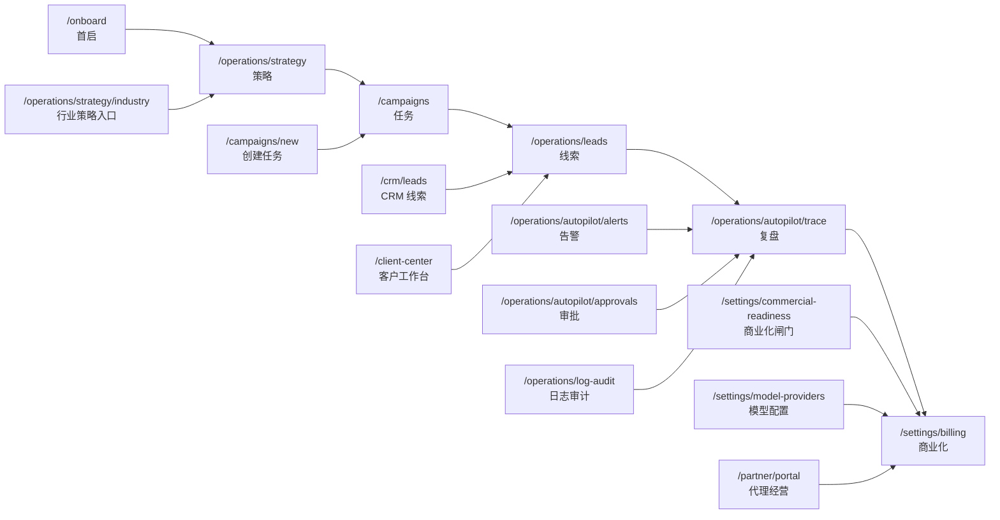
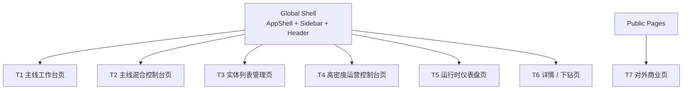

# Frontend Mainline And Template Blueprint

更新时间：2026-04-13

本文是 [FRONTEND_PAGE_COMPONENT_MAP.md](./FRONTEND_PAGE_COMPONENT_MAP.md) 的继续版，目标不是再列一遍目录，而是回答 3 个更工程化的问题：

1. 当前前端的主线页面体系到底是什么。
2. 控制台页面实际上可以归并成哪几种模板。
3. 下一步最值得收口的组件和页面，优先级怎么排。

---

## 一、主线页面体系图

### 1. 主线定义

当前前端最清晰的一条产品主线是：

1. 首启
2. 策略
3. 任务
4. 线索
5. 复盘
6. 商业化

这条线同时存在于：

- 首页主指挥页
- Header 顶部主线导航
- `MainlineStageHeader`

也就是说，主线不是文案层概念，而是已经进入页面壳子和导航系统的产品结构。

### 2. 主线体系图



### 3. 主线页的职责边界

#### 3.1 一级主线页

- `/onboard`
  - 负责确认行业、目标、执行边界
- `/operations/strategy`
  - 负责制定策略、选择执行模式、发起同步或异步任务
- `/campaigns`
  - 负责筛出“今天要推进的任务”
- `/operations/leads`
  - 负责判断“今天谁该被优先跟进”
- `/operations/autopilot/trace`
  - 负责解释执行结果、风险来源、审批和回滚路径
- `/settings/billing`
  - 负责把业务闭环映射到订阅、账单、回调、通知、可收费状态

#### 3.2 二级支撑页

这些页面不是新主线，而是某个主线步骤的“支撑工作台”。

- 策略支撑
  - `/operations/strategy/industry`
- 任务支撑
  - `/campaigns/new`
- 线索支撑
  - `/crm/leads`
  - `/client-center`
  - `/client-mobile`
- 复盘支撑
  - `/operations/autopilot/alerts`
  - `/operations/autopilot/approvals`
  - `/operations/log-audit`
- 商业化支撑
  - `/settings/commercial-readiness`
  - `/settings/model-providers`
  - `/partner/portal`

### 4. 主线页当前的结构共性

当前 13 个页面已经接入 `MainlineStageHeader`，说明它们共享以下结构特征：

- 有明确“当前是第几步”的产品语义
- 页面不只是做 CRUD，而是在帮助用户做下一步判断
- 页面顶部通常先给方向，再给数字，再给操作区域

从样本页看，主线页实际都在重复下面这个骨架：

```text
MainlineStageHeader
  -> KPI / 状态摘要
  -> 决策卡片或判断卡片
  -> 当前视角 / 风险 / 上下文区
  -> 主工作区（列表、表单、审计、结果）
  -> 上下游跳转
```

这套骨架已经出现在：

- `/campaigns`
- `/operations/leads`
- `/operations/strategy`
- `/operations/autopilot/trace`
- `/settings/billing`

也就是说，主线其实已经具备“页面模板”的雏形，只是还没有被正式抽象出来。

---

## 二、控制台页面模板图

### 1. 模板总览

当前前端可以归纳成 6 种高频模板，而不是 103 个完全独立的页面。



### 2. 模板定义

| 模板 | 核心目标 | 代表页面 | 当前共用组件 | 下一步建议 |
|---|---|---|---|---|
| `T1 主线工作台页` | 让用户完成主线中的一个步骤 | `/campaigns` `/operations/leads` `/operations/strategy` | `MainlineStageHeader` `Button` | 抽 `MainlineWorkspacePage`、`NarrativeMetricGrid`、`DecisionPanelGroup` |
| `T2 主线混合控制台页` | 既保留主线叙事，又承载高密度控制逻辑 | `/operations/autopilot/trace` `/settings/billing` `/partner/portal` | `MainlineStageHeader` `Card` `Button` | 抽 `MainlineConsolePage`、`ControlSectionCard`、`ActionRail` |
| `T3 实体列表管理页` | 搜索、筛选、批量操作、表格管理 | `/operations/channels` `/settings/audit` `/lobsters/runs` | `EntityListPage` `DataTable` | 抽 `EntityTablePage`，推动更多手写 table 迁移 |
| `T4 高密度运营控制台页` | 多指标、多控制面板、多表格并列操作 | `/operations/autopilot` `/operations/control-panel` `/operations/mcp` | `Card` `Button` `Dialog` | 抽 `OperationsConsolePage`、`ConsoleMetricStrip`、`ConsoleFilterBar` |
| `T5 运行时仪表盘页` | 看状态、看资源、看实时执行、做快速动作 | `/fleet` `/dashboard/lobster-pool` `/devices` | `Card` 图表组件、域组件 | 抽 `RuntimeDashboardPage`、`RuntimeStatCard`、`ActionDrawerSlot` |
| `T6 详情 / 下钻页` | 查看某个实体、运行、配置或执行记录的详情 | `/dashboard/lobster-pool/[id]` `/lobsters/[id]` `/operations/usecases/[id]` | `Card` 域详情组件 | 抽 `DetailDashboardPage` |
| `T7 对外商业页` | 拉新、注册、登录、定价、品牌展示 | `/landing` `/pricing` `/login` `/register` | 独立页面结构 | 维持独立，不强行套控制台模板 |

### 3. 模板特征详解

#### T1 主线工作台页

代表页面：

- `/campaigns`
- `/operations/leads`
- `/operations/strategy`

当前共性：

- 顶部 `MainlineStageHeader`
- 第一屏通常有 3 到 4 个指标卡
- 接着是“今天先做什么”的判断区
- 再进入主工作区

当前缺口：

- `SummaryCard`
- `DecisionCard`
- `InfoPanel`

这些局部组件在多个页面里重复定义，还没有上升成共享组件。

#### T2 主线混合控制台页

代表页面：

- `/operations/autopilot/trace`
- `/settings/billing`
- `/partner/portal`

当前共性：

- 有主线头部，但中下部是强控制台结构
- 通常同时包含：
  - KPI
  - 复杂表单或操作区
  - 多个 Card 面板
  - 风险或状态回显

这类页面已经超出“简单主线页”，但又不能完全去掉主线叙事。

#### T3 实体列表管理页

代表页面：

- `/operations/channels`
- `/settings/audit`
- `/lobsters/runs`
- `/campaigns` 的一部分已经接近这个模板

当前共性：

- `EntityListPage`
- 过滤器
- 表格
- 批量操作

当前问题：

- 只有 4 个页面真正用了 `DataTable`
- 仍有 16 个页面直接手写 `<table>`

这说明列表页模板没有真正收口。

#### T4 高密度运营控制台页

代表页面：

- `/operations/autopilot`
- `/operations/control-panel`
- `/operations/mcp`

当前共性：

- 页面内同时存在多个控制面板
- 不是单一工作流，而是“监控 + 配置 + 操作 + 反馈”并列
- 大量用 `Card` 作为面板容器

这类页面的问题不是基础组件缺失，而是缺少“页面级布局模板”。

#### T5 运行时仪表盘页

代表页面：

- `/fleet`
- `/dashboard/lobster-pool`
- `/devices`

当前共性：

- 第一屏看系统健康、资源、活跃度
- 中段看实体卡片、实时状态、图表
- 底部看近期事件、模型成本、历史记录

这类页面已经很像“运行态控制面”，后面非常适合抽成统一模板。

#### T6 详情 / 下钻页

代表页面：

- `/dashboard/lobster-pool/[id]`
- `/lobsters/[id]`
- `/operations/usecases/[id]`
- `/operations/workflows/[id]/executions`

当前共性：

- 以某个实体为中心
- 组合多个 detail card、timeline、chart、log panel

这类页面适合单独形成 `DetailDashboardPage`，而不是被归到列表页或控制台页。

---

## 三、组件收口与重构优先级

### 1. 当前重复最明显的局部组件

这批组件目前还在页面文件里反复定义，是最适合先抽的。

#### 1.1 `SummaryCard`

出现位置：

- `app/ai-brain/prompt-lab/page.tsx`
- `app/campaigns/page.tsx`
- `app/fleet/proxies/page.tsx`
- `app/operations/autopilot/alerts/page.tsx`
- `app/operations/autopilot/artifacts/page.tsx`
- `app/operations/autopilot/modes/page.tsx`
- `app/operations/autopilot/trace/page.tsx`
- `app/operations/log-audit/page.tsx`
- `components/business/LeadsWorkspace.tsx`

建议抽象：

- `components/patterns/MetricCard.tsx`

#### 1.2 `DecisionCard`

出现位置：

- `app/campaigns/page.tsx`
- `components/business/LeadsWorkspace.tsx`

建议抽象：

- `components/patterns/DecisionCard.tsx`

#### 1.3 `InfoPanel`

出现位置：

- `app/campaigns/page.tsx`
- `components/business/LeadsWorkspace.tsx`

建议抽象：

- `components/patterns/InfoPanel.tsx`

#### 1.4 `Field`

出现位置：

- `app/ai-brain/content/page.tsx`
- `app/operations/mcp/page.tsx`
- `app/operations/scheduler/page.tsx`
- `app/operations/strategy/industry/page.tsx`
- `app/operations/strategy/page.tsx`
- `app/operations/workflows/[id]/edit/page.tsx`
- `app/operations/workflows/[id]/triggers/page.tsx`
- `app/operations/workflows/page.tsx`
- `app/operations/workflows/templates/page.tsx`
- `app/register/page.tsx`
- `app/reset-password/page.tsx`

建议抽象：

- `components/patterns/FormFieldBlock.tsx`

### 2. 当前最值得迁移到 DataTable 的页面

扫描到仍然手写 `<table>` 的页面有 16 个：

- `app/ai-brain/radar/page.tsx`
- `app/campaigns/page.tsx`
- `app/dashboard/lobster-pool/[id]/page.tsx`
- `app/dashboard/lobster-pool/page.tsx`
- `app/devices/page.tsx`
- `app/fleet/fingerprints/page.tsx`
- `app/fleet/page.tsx`
- `app/fleet/proxies/page.tsx`
- `app/operations/autopilot/page.tsx`
- `app/operations/autopilot/trace/page.tsx`
- `app/operations/calendar/page.tsx`
- `app/operations/control-panel/page.tsx`
- `app/operations/mcp/page.tsx`
- `app/page.tsx`
- `app/reseller/page.tsx`
- `app/settings/team/page.tsx`

其中最适合第一批迁移的不是全部，而是这些：

#### P0 第一批

- `app/campaigns/page.tsx`
  - 已经用了 `EntityListPage`
  - 最接近 `EntityTablePage`
- `app/settings/team/page.tsx`
  - 典型管理表格页
- `app/operations/mcp/page.tsx`
  - 强列表属性
- `app/operations/calendar/page.tsx`
  - 筛选 + 列表明显
- `app/reseller/page.tsx`
  - 商务管理型列表页

#### P1 第二批

- `app/operations/control-panel/page.tsx`
- `app/devices/page.tsx`
- `app/ai-brain/radar/page.tsx`

#### P2 保持手写或谨慎改造

- `app/operations/autopilot/trace/page.tsx`
- `app/operations/autopilot/page.tsx`
- `app/fleet/page.tsx`
- `app/dashboard/lobster-pool/page.tsx`
- `app/dashboard/lobster-pool/[id]/page.tsx`
- `app/page.tsx`

这些页面的表格只是复合控制台的一部分，不能简单迁成“纯列表页”。

### 3. 建议新增的模板组件

### P0

- `components/page-templates/MainlineWorkspacePage.tsx`
  - 封装 `MainlineStageHeader + KPI 区 + 决策区 + 主工作区`
- `components/patterns/MetricCard.tsx`
- `components/patterns/DecisionCard.tsx`
- `components/patterns/InfoPanel.tsx`
- `components/patterns/FormFieldBlock.tsx`
- `components/page-templates/EntityTablePage.tsx`
  - 基于 `EntityListPage + DataTable`

### P1

- `components/page-templates/MainlineConsolePage.tsx`
  - 用于 `Trace / Billing / Partner Portal`
- `components/page-templates/OperationsConsolePage.tsx`
  - 用于 `Autopilot / MCP / Control Panel`
- `components/page-templates/RuntimeDashboardPage.tsx`
  - 用于 `Fleet / Lobster Pool / Devices`

### P2

- `components/page-templates/DetailDashboardPage.tsx`
- `components/patterns/ConsoleMetricStrip.tsx`
- `components/patterns/ActionRail.tsx`
- `components/patterns/SectionCard.tsx`

---

## 四、建议的实施顺序

### 第一阶段：先统一主线页

目标：

- 让主线页面在视觉和结构上完全同语法

动作：

- 抽 `MetricCard`
- 抽 `DecisionCard`
- 抽 `InfoPanel`
- 抽 `MainlineWorkspacePage`

优先页面：

- `/campaigns`
- `/operations/leads`
- `/operations/strategy`
- `/operations/autopilot/trace`

### 第二阶段：再统一列表页

目标：

- 让表格管理页收敛到 `EntityTablePage`

动作：

- 先迁移第一批手写 table
- 保留高密度控制台页内的特殊表格

优先页面：

- `/campaigns`
- `/settings/team`
- `/operations/mcp`
- `/operations/calendar`
- `/reseller`

### 第三阶段：最后统一控制台模板

目标：

- 降低 `Autopilot / Fleet / Lobster Pool / Control Panel` 这类页面的布局维护成本

动作：

- 抽 `OperationsConsolePage`
- 抽 `RuntimeDashboardPage`
- 把局部卡片和操作条收口

优先页面：

- `/operations/autopilot`
- `/operations/control-panel`
- `/fleet`
- `/dashboard/lobster-pool`

---

## 五、最后判断

### 1. 这个前端现在最像什么

它已经不是“功能堆页面”的阶段了，而是进入了：

- 一条主线产品体验
- 几个控制台型子系统
- 一套开始成形但还没完全收口的设计系统

### 2. 最关键的收口点

不是先重写样式，而是先统一页面模板。

原因是：

- 页面太多，先动样式收益小
- 模板一旦统一，后续 UI、交互、埋点、测试都会一起变简单

### 3. 最推荐的落地顺序

1. 把主线页模板化
2. 把列表页模板化
3. 再把高密度控制台模板化

如果继续往下做，下一份最值得产出的不是再写说明文档，而是直接做一版：

- `MainlineWorkspacePage`
- `MetricCard`
- `DecisionCard`
- `InfoPanel`

然后先把 `/campaigns` 和 `/operations/leads` 收成第一批模板页。
